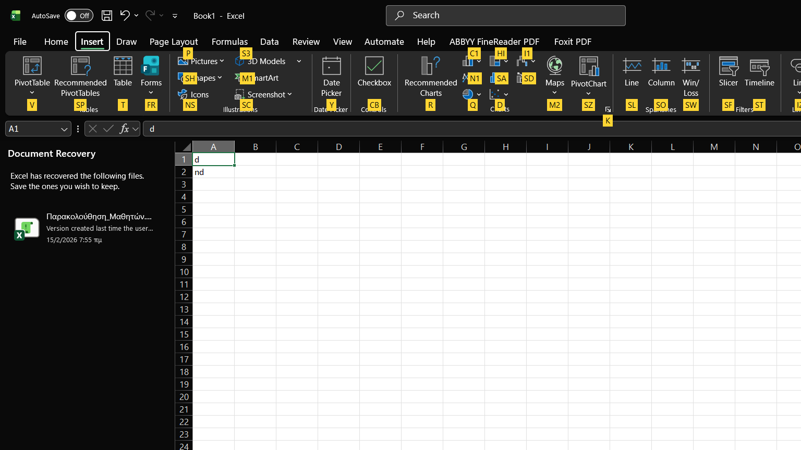
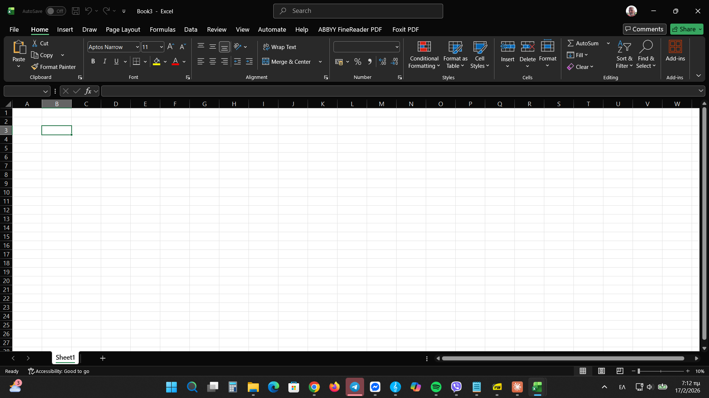

# Excel Calendar Date Picker

**Version:** 1.0.0 | **Excel:** 2013–Office 365 | **Windows:** 10 or later | **Free**

---

## Overview

Excel Calendar Date Picker is a professional add-in that provides a visual calendar interface for easy date selection in Excel cells. No more manual date typing — just click and select!

## Features

✅ **Visual Calendar Interface** — Beautiful calendar dialog  
✅ **Large Ribbon Button** — Professional calendar icon in the INSERT tab  
✅ **Keyboard Shortcut** — Quick access with **Ctrl+Shift+D**  
✅ **Smart Date Detection** — Automatically loads existing cell dates  
✅ **International Support** — Works with any regional date format  
✅ **Auto-Format** — Automatically formats selected cells as dates  
✅ **No Dependencies** — Pure VBA, no .NET or extra installs required  
✅ **Privacy-Focused** — No data collection, works 100% offline  

---

## Installation

### Option 1 — Quick Install (Recommended)
1. Download **ExcelDatePicker.xlam** from the [Releases](../../releases) page
2. Double-click the file to open it in Excel
3. Click **Enable Content** when prompted
4. Restart Excel
5. Done! Look for **Date Picker** in the **INSERT** tab

### Option 2 — Manual Install
1. Download **ExcelDatePicker.xlam**
2. Open Excel → **File > Options > Add-ins**
3. At the bottom, select **Excel Add-ins** → click **Go**
4. Click **Browse** and select the downloaded file
5. Check the box next to **Excel Date Picker** → click **OK**

---

## Usage

### Via Ribbon Button
1. Select a cell
2. Go to **INSERT** tab
3. Click **Date Picker**
4. Choose a date → click **OK**

### Via Keyboard Shortcut
1. Select a cell
2. Press **Ctrl+Shift+D**
3. Choose a date → click **OK**

---

## System Requirements

| | |
|---|---|
| **Excel** | 2013, 2016, 2019, 2021, Office 365 |
| **OS** | Windows 10 or later |
| **Size** | < 1 MB |
| **Dependencies** | None |

---

## Troubleshooting

**Add-in doesn't appear in Excel**  
→ Go to File > Options > Add-ins > Excel Add-ins and make sure it's checked. Restart Excel.

**Ctrl+Shift+D doesn't work**  
→ Another add-in may be using the same shortcut. Use the Ribbon button instead.

**Calendar doesn't pre-select existing date**  
→ Make sure the cell value is recognized as a date by Excel (not stored as text).

---

## License

MIT License — free to use, modify, and distribute.

---

*Developed with ❤️ for Excel users worldwide*
