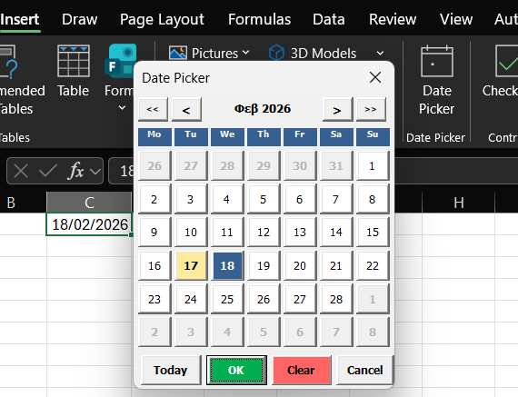
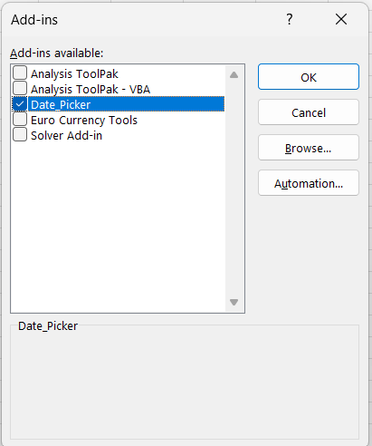

# Excel Calendar Date Picker

**Version:** 1.0.0 | **Excel:** 2013–Office 365 | **Windows:** 10 or later | **Free**

---

## Overview

Excel Calendar Date Picker is a professional add-in that provides a visual calendar for easy date selection directly in Excel cells. **No more manual date typing** — just click a date and it's done!

> 🌍 **Fully respects your system's Regional Settings** — the calendar displays day names, month names and date formats exactly as configured in your Windows Regional Settings (Control Panel → Region). Whether you use DD/MM/YYYY, MM/DD/YYYY, Greek, English, German or any other locale, the add-in adapts automatically with no configuration needed.

---

## Features

✅ **Single-click date selection** — click a date and the cell updates instantly  
✅ **Large Ribbon Button** — professional calendar icon in the INSERT tab  
✅ **Keyboard Shortcut** — quick access with **Ctrl+Shift+D**  
✅ **Smart Date Detection** — automatically loads the existing date from the cell  
✅ **Regional Settings** — uses your Windows locale for day/month names and date format  
✅ **Auto-Format** — automatically formats the cell as a date  
✅ **No Dependencies** — pure VBA, no .NET or extra installs required  
✅ **Privacy-Focused** — no data collection, works 100% offline  

---

## Installation

### Option 1 — Quick Install (Recommended)
1. Download **ExcelDatePicker.xlam** from the [Releases](../../releases) page
2. Double-click the file to open it in Excel
3. Click **Enable Content** when prompted
4. Restart Excel
5. Done! Look for **Date Picker** in the **INSERT** tab

### Option 2 — Manual Install
1. Download **ExcelDatePicker.xlam**
2. Open Excel → **File > Options > Add-ins**
3. At the bottom, select **Excel Add-ins** → click **Go**
4. Click **Browse** and select the downloaded file
5. Check the box next to **Date_Picker** → click **OK**

---

## Usage

### Via Ribbon Button
1. Select a cell
2. Go to **INSERT** tab
3. Click **Date Picker**
4. Click any date — the cell updates instantly

### Via Keyboard Shortcut
1. Select a cell
2. Press **Ctrl+Shift+D**
3. Click any date — the cell updates instantly

---

## Regional Settings

The add-in **automatically detects your Windows Regional Settings** and adapts accordingly:

- **Day and month names** are displayed in your system language
- **Week start day** follows your locale (Monday or Sunday)
- **Date format** written to the cell matches your regional preference

To change the locale, go to **Windows Settings → Time & Language → Region** — no changes needed inside Excel or the add-in.

---

## System Requirements

| | |
|---|---|
| **Excel** | 2013, 2016, 2019, 2021, Office 365 |
| **OS** | Windows 10 or later |
| **Size** | < 1 MB |
| **Dependencies** | None |

---

## Troubleshooting

**Add-in doesn't appear in Excel**  
→ Go to File > Options > Add-ins > Excel Add-ins and make sure **Date_Picker** is checked. Restart Excel.

**Ctrl+Shift+D doesn't work**  
→ Another add-in may be using the same shortcut. Use the Ribbon button instead.

**Calendar doesn't pre-select existing date**  
→ Make sure the cell value is recognised as a date by Excel (not stored as text).

---

## License

MIT License — free to use, modify, and distribute.

---

*Developed with ❤️ for Excel users worldwide*
